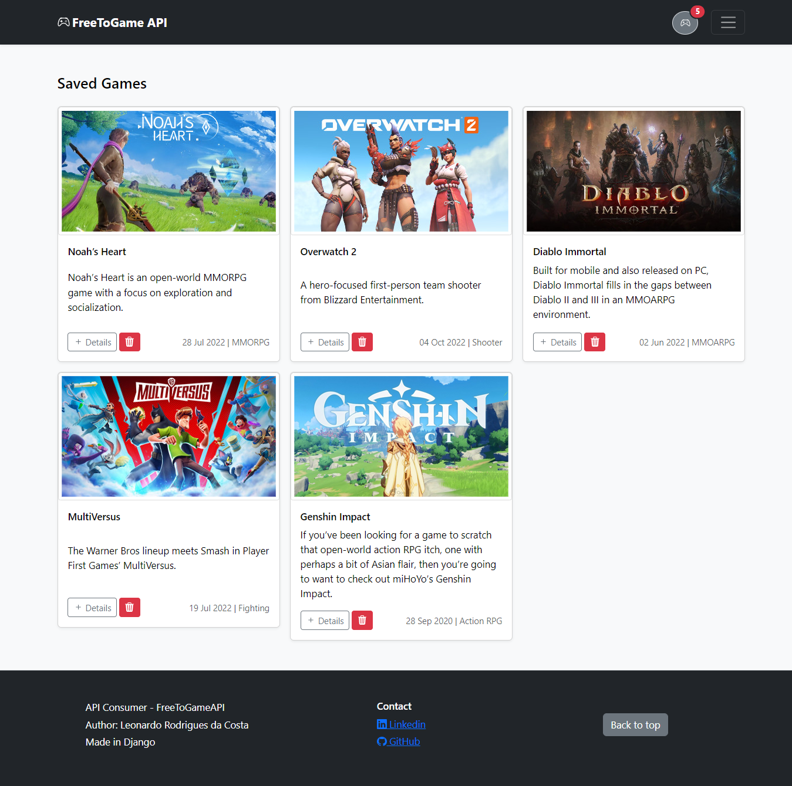

<h1 align='center'>
    FreeToGame API Consumer com Python e Django
</h1>
<p align="center">
    
    
</p>

<h2 align='center'>Tecnologias Utilizadas</h2>

<br>
<div align='center'>
    
    
    
    
    
    
</div>
<br>

<h2 align='center'>Sobre</h2>

<p align="justify">
Depois de um tempo estudando programação decidi usar python como minha linguagem principal e o motivo principal dessa escolha foi principalmente por sua interdisciplinaridade. Com python podemos desenvolver desde aplicações desktop e mobile até aplicações Web completas, podemos criar projetos inteiros e dashboads para análise de dados e podemos também usar essa linguagem para projetos robustos de aprendizado de máquina e processamento digital de imagens. Enfim, acho que já entenderam onde quero chegar, eu gosto da liberdade de escolher uma area de estudos e não ter que voltar à estaca zero em uma linguagem de programação. Por mais que qualquer uma dessas aplicações que citei nas linhas acima possam ser implementadas em alguma outra linguagem, python tem outro ponto que me encantou muito, sua facilidade de aprendizado e por isso uso python como linguagem principal e pretendo continuar usando em projetos futuros.
</p> 

<p align="justify">
O Projeto que irei apresentar nessa breve descrição tem um peso simbólico um pouco maior para mim do que outros projetos meus que também foram implementados em python ou em django, porque nele eu pensei, estruturei e configurei do zero, ou seja, meus erros e acertos nesse projeto vieram basicamente de mim. O que me deixa um pouco orgulhoso, visto que, por mais que não seja uma aplicação complexa, ela tem um pouco de mim e um pouco dos meus gostos.
</p>


Enfim, e do que se trata esse projeto? Esse projeto, implementado em python como linguagem principal e que usa o django como framework tem o intuito de ser uma página para consulta de detalhes sobre jogos dos mais variados tipos e plataformas. Os dados sobre cada jogos são reais e cedidos pela API do site [FreeToGame](https://www.freetogame.com) a [FreeToGame API](https://www.freetogame.com/api-doc). 


<h2 align='center'>Página Inicial</h2>


Essa é a página inicial do projeto, onde a aplicação faz uma consulta diretamente a API e retorna o template [index.html](./consumer/templates/index.html).

<br>
<div>
    
</div>
<br>

Essa página conta com uma navbar que contem três elementos principais, contados da direita para esquerda:

* **Menu de Hamburger** que contém informações sobre o que o projeto faz.
* **Botão de games salvos** onde, ao clicá-lo, você será redirecionado para outra página que contém todos os games que você salvou para consultas posteriores. Obs.: Este botão só aparece no caso de você já ter salvo algum jogo, caso contrário ele fica oculto.
* **Logo da Aplicação** que também é um link para página principal da aplicação.

Logo abaixo da navbar você pode ver três filtros. Esses filtros foram construidos levandos em consideração os resultados que poderiam ser retornados da própria API, sendo assim, você pode filtrar os resultados:

* **Por plataforma** a API oferece três possibilidades nesse caso, todas as plataformas, jogos para PC ou jogos para browser.
* **Por categoria** do jogo. Ex.: fps, moba, mundo aberto ... 
* **Por ordem** retorna os resultados por uma ordem especificada no filtro, como por exemplo, por ordem de lançamento do jogo, ordem alfabética ...

Abaixo dos filtros estão os resultados da pesquisa ou todos os jogos carregados inicialmente. Cada jogo conta com dois botões, um botão de detalhes, onde ao clicá-lo você será redirecionado para página de detalhes do jogo e o botão salvar, para consultas posteriores.

A página de detalhes do jogo é mostrada jogo a seguir.

<h2 align='center'>Detalhes</h2>

Nesse template estão todos os detalhes de cada jogo fornecidos pela API, renderizados de uma maneira amigável. 

<br>
<div>
    
</div>
<br>

Essa página conta com três seções, onde a primeira mostra a thumnail do game e seus requisitos mínimos, caso esse game seja para PC. A segunda seção conta com uma descrição do jogo seguido de uma série de screenshots do game que serão renderizadas se a API fornecer essas informações e em seguida uma seção sobre informações comerciais do game, além de links externos para a página do game ou para a profile do game no site do FreeToGame. 

O terceiro e ultimo template é o mostrado a seguir, o template de games salvos.

<h2 align='center'>Games Salvos</h2>

Essa é a página mais simples contando somente com os cards referentes a cada game que você salvou no decorrer da sua pesquisa na página inicial. 

<br>
<div>
    
</div>
<br>

A única particularidade de cada card desse template em relação aos cards do template da página inicial é que cada um contém um botão para excluir o game da lista de games salvos.

<h2 align='center'>Rodando o projeto na sua máquina</h2>

Bem, se algum dia alguém que estiver começando nos estudos sobre django topar com esse repositório e quiser testar esse projeto, vou deixar um tutorial passo a passo para rodar a aplicação localmente. 

Inicialmente, recomendo o uso de um ambiente virtual, para não poluir o seu ambiente principal de desenvolvimento. Em python, você pode criar um ambiente virtual usando o seguinte comando. 

```
python -m venv venv
```

No comando acima você pede para o python criar um ambiente virual com o nome `venv`. Lembrando que se você quiser nomeá-lo de outra forma, basta trocar a segunda string de nome `venv` para o nome de sua escolha. 

Depois de criado, precisamos ativar o ambiente virtual, que no Windows o comando seria o seguinte:

```
venv\Scripts\activate
```

Depois de ativado você poderá ver a sua linha de comando parecida com a mostrada abaixo:

```
(venv) C:\Users\User\Desktop\freetogameapi-django>
```

Finalizada a configuração do ambiente virtual, precisamos instalar as dependencias do nosso projeto. Note que na raiz desse repositório você pode encontrar um arquivo chamado [requirements.txt](./requirements.txt). Nele estão todas as dependências que esse projeto precisa para funcionar. Para instalar as dependencias desse projeto basta digitar no seu terminal:

```
pip install -r requirements.txt
```

Okay, depois tudo isso ainda temos um passo importante que devemos fazer para que nosso projeto funcione corretamente. Execute em sequencia os dois comandos abaixo:

```
python manage.py makemigrations
python manage.py migrate
```

No django os dois comandos acima irão configurar o banco de dados para aplicação, caso seja necessário usálo. 

<h3 align='center'>Iniciando o projeto e acessando a aplicação</h3>

Depois que passamos pelo estágio inicial de configuração da nossa aplicação podemos iniciá-la com o comando abaixo:

```
python manage.py runserver
```

Se tudo correu bem até aqui, o nosso servidor local será iniciado e você verá uma mensagem como a abaixo no seu terminal:

```
Watching for file changes with StatReloader
Performing system checks...

System check identified no issues (0 silenced).
April 04, 2023 - 11:16:08
Django version 4.1.7, using settings 'app.settings'
Starting development server at http://127.0.0.1:8000/
Quit the server with CTRL-BREAK.
```

Depois disso, basta acessar o IP `127.0.0.1:8000` no seu navegador e testar a aplicação. 


<h2 align='center'>Referências</h2>

* [FreeToGame API](https://www.freetogame.com/api-doc)
* [Bootstrap Docs](https://getbootstrap.com/docs/5.3/getting-started/introduction/)
* [Django Docs](https://docs.djangoproject.com/en/4.2/)


